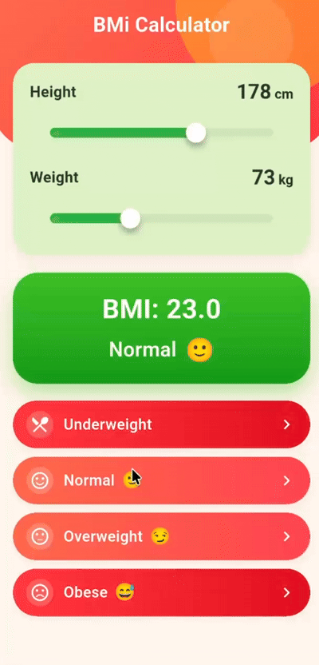

# BMI Calculator (Flutter)

A clean and modern **BMI (Body Mass Index) Calculator** built with **Flutter**.  
Adjust height and weight using sliders and instantly get your BMI value with a category indicator.

<p align="center">
  
</p>

<p align="center">
  <a href="https://flutter.dev"></a>
  <a href="https://dart.dev"></a>
  
</p>

[](https://flutter.dev)
[](https://dart.dev)


---

## Features

- **Beautiful UI** with gradients, soft shadows, and a card-based layout
- **Height & weight sliders** for quick input
- **Instant BMI calculation** with one-decimal precision
- **Automatic category detection** (Underweight, Normal, Overweight, Obese)
- **Responsive layout** (works across different screen sizes)

---

## BMI Logic (How it works)

### 1) Inputs

- Height in **centimeters (cm)**
- Weight in **kilograms (kg)**

### 2) Convert height to meters

```dart
var heightMeters = heightCm / 100;
```

### 3) Calculate BMI

The standard BMI formula is used:

```dart
var bmi = weightKg / (heightMeters * heightMeters);
```

### 4) Determine Category

The calculated BMI value is used to determine the weight category:

| BMI Range           | Category      |
| ------------------- | ------------- |
| Less than 18.5      | Underweight   |
| 18.5 – 24.9         | Normal weight |
| 25.0 – 29.9         | Overweight    |
| 30.0 or greater     | Obese         |
